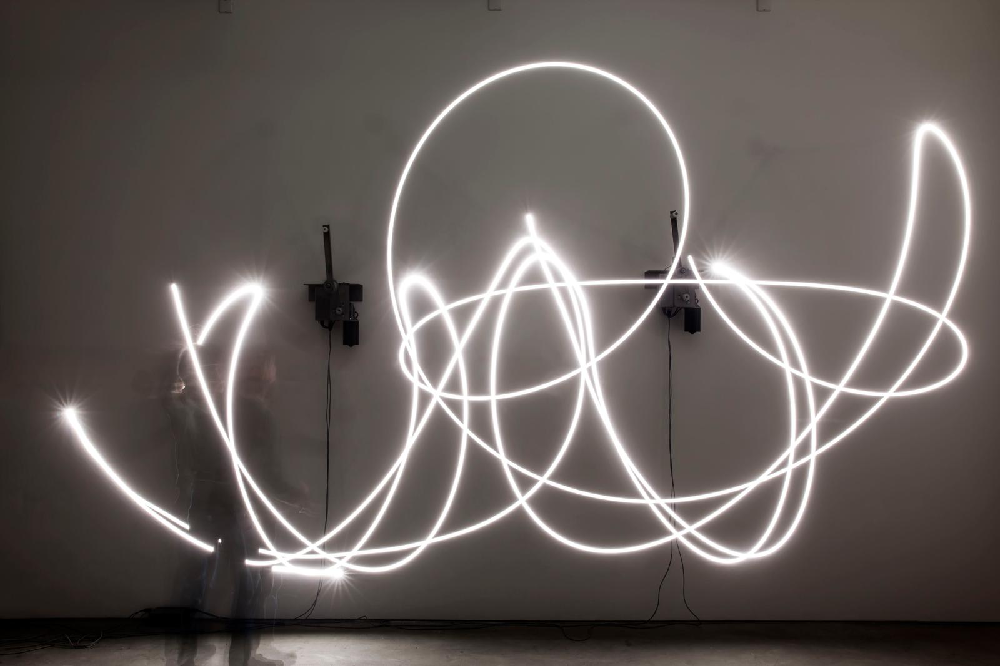
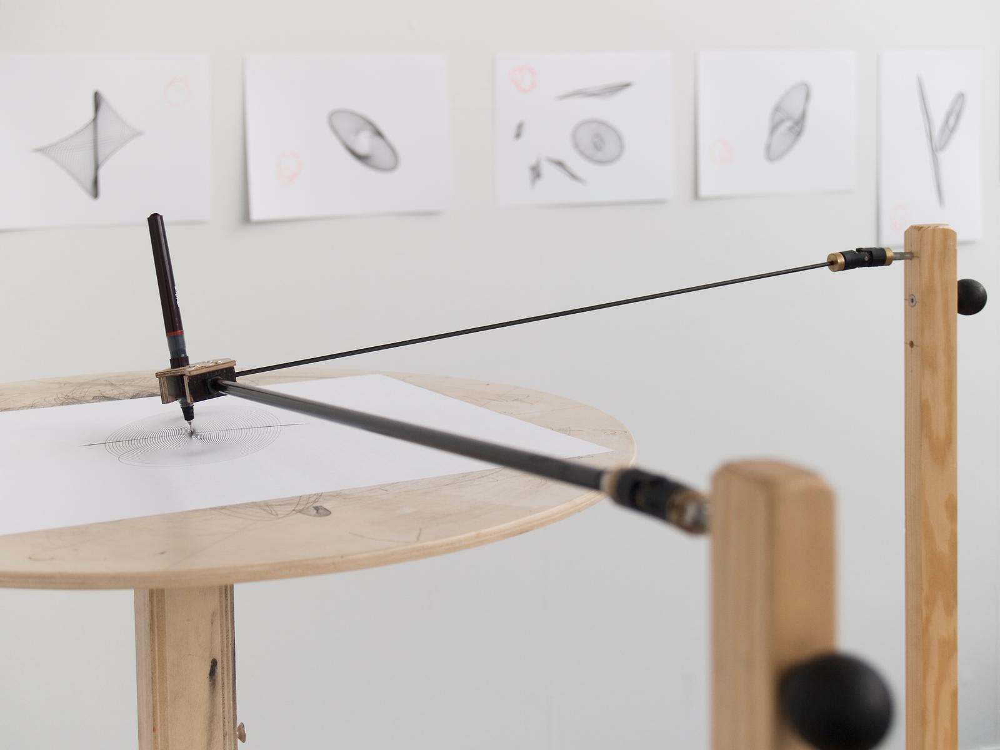
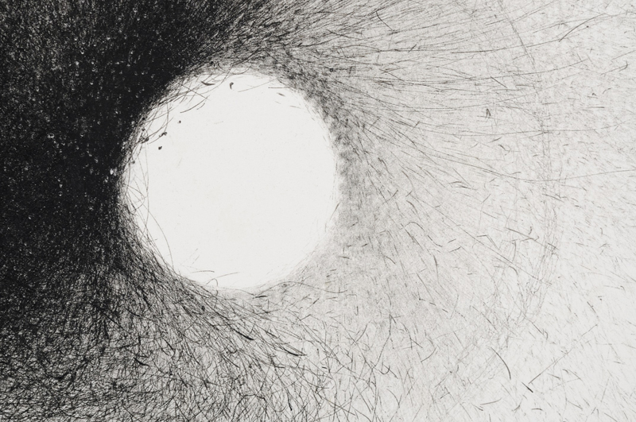
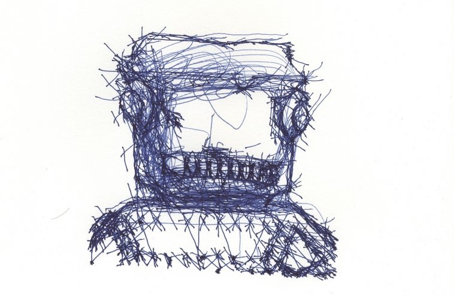
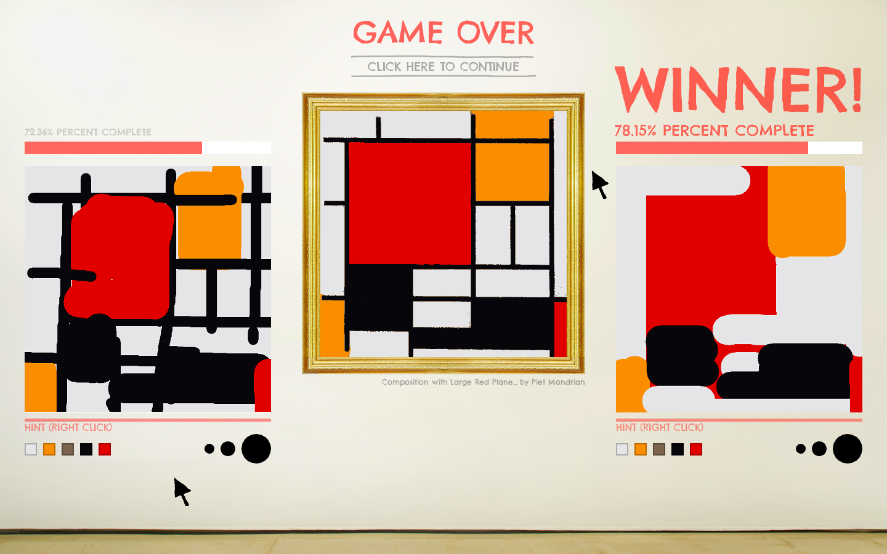
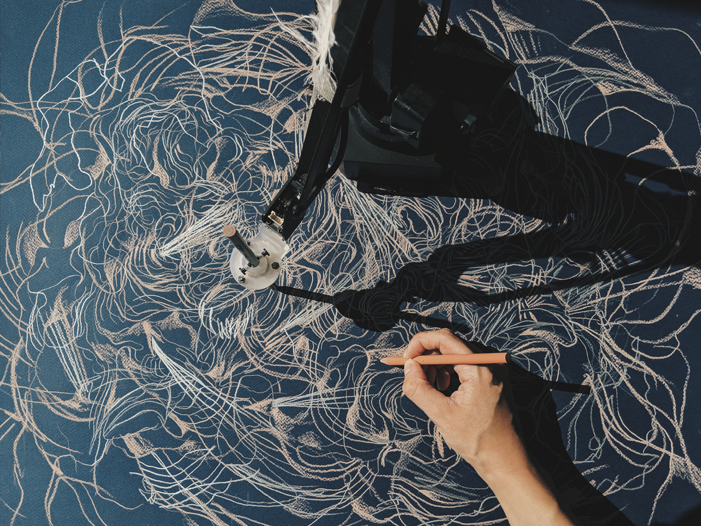

# Day 04

## Schedule

|Time               |Desc                                      |
|---                |---                                       |
|9:30 - 9:45        | Intro of the day                         |
|9:45 - 10:00       | Sharing                                  |
|10:00 - 12:00      | Work on assignement                      |
|12:00 - 13:00      | Lunch break :sushi:                      |
|13:00 - 15:00      | Work on assignement                      |

## :pencil2::slot_machine: Drawing Machines

### Brief

Create a program that expands, augment, distort, questions, complicate, interpret, improves the act of drawing. Explain what your system is about: is it a tool? A statement? a game? Use your tool to __create your original series of at least 3 drawings.__ [^note-id1]

You do not have to draw your idea on paper first but sketching some ideas on paper is recommended ;)

### Variations / Steps [^note-id1]

- [ ] Bring your drawing to life
- [ ] Forget about your right or left hand, how else can you draw something?
- [ ] Create a machine that requires more than 1 user to be operated
- [ ] Make a single purpose drawing machine (a machine that only draw ducks)
- [ ] Identify and challenge some other assumptions about drawing, for example:
    - Drawings are made of flat surface
    - Drawings is meant to endure
    - Drawings can be finished
    - etc...
- [ ] Make a tool that functions critically. For instance that rejects the tech imperative of accuracy, realism, utility and instead focus on expressivity, irreproducibility, etc...

## Deliverables

* 3 drawings
* Code and documentation of your process, add some live example + gifs / images.
* Include a scan or photo of your drawings in the post

## More on drawing machines

### References

  
[_Your unpredictable sameness, Studio Olafur Eliasson, 2014_](https://olafureliasson.net/archive/artwork/WEK108972/your-unpredictable-sameness#slideshow)

  
[_Olafur Eliasson drawing machines_](https://olafureliasson.net/tag/TEL3158/drawing-machines)

  
[_Cameron Robbins wind drawing machines_](http://cameronrobbins.com/wind-drawings/)

The Wind Drawing Machines are installed in different locations to receive weather energy and translate it into an abstract format of ink drawings on paper.

  
[_Patrick Tresset - Toy Robot, 2019_](https://patricktresset.com/new/project/toy-robot-2019/)

Patrick Tresset is a Brussels-based artist who, in his work, explores human traits and the aspects of human experience. His work reflects recurrent ideas such as embodiment, passing time/time passing, childhood, conformism, obsessiveness, nervousness, the need for storytelling, and mark-making. He is best known for his performative installations using robotic agents as stylized actors that make marks and for his exploration of the drawing practice using computational systems and robots. ([youtube channel](https://www.youtube.com/c/PatrickTresset/videos))

  
<iframe src="https://player.vimeo.com/video/19372180?h=c2c7041188&color=ffffff&title=0&byline=0&portrait=0" width="640" height="360" frameborder="0" allow="autoplay; fullscreen; picture-in-picture" allowfullscreen></iframe>

<a href="https://vimeo.com/19372180">Conductor: www.mta.me</a> from <a href="https://vimeo.com/alexanderchen">Alexander Chen</a> on <a href="https://vimeo.com">Vimeo</a>.
  
  

At www.mta.me, Conductor turns the New York subway system into an interactive string instrument. Using the MTA's actual subway schedule, the piece begins in realtime by spawning trains which departed in the last minute, then continues accelerating through a 24 hour loop. The visuals are based on Massimo Vignelli's 1972 diagram. ([Alexander Chen](https://www.chenalexander.com/))

  
[_Sloppy Forgeries - Jonah Warren_](http://playfulsystems.com/sloppy-forgeries/)

Sloppy Forgeries is a fast-paced, two-player local multiplayer painting game. Each player is given a mouse, a blank canvas, and a few simple paint tools. Each round, a famous painting from art history is revealed. Players race to copy the painting as quickly and accurately as possible.

  
[_Sougwen Chung - Artefacts_](https://sougwen.com/project/artefact1)

Artefact 1 explores artistic co-creation and is the outcome of an improvisational drawing collaboration with a custom robotic unit linked to a recurrent neural net trained on my drawings. The contrasting colors of lines denote those marks made by the machine and my own hand.  This work is the latest in an ongoing series of Drawing Operations begun in 2014.

  
[_Do not draw a penis - Studio Moniker_](https://studiomoniker.com/projects/do-not-draw-a-penis)

Do Not Draw a Penis functions as an agent to collect inappropriate doodles from people who are not willing to stay within the moral guidelines set by our social network providers.

> You will find code examples in the book [Generative Gestaltung (P_2_2_6)](http://www.generative-gestaltung.de/2)  
> Check :sparkles: [Pinterest Drawing machine board](https://www.pinterest.ch/9uill0m/generative-class/dawing-machines/)   *(temp pinterest account: tmp.pin@gmail.com / TT4[bosses )*  
> [Pinterest drawbots](https://www.pinterest.co.uk/gonzillaaa/drawbots/)

### Example

  
<iframe src="https://preview.p5js.org/guma/embed/gJAZwbKlG" width="100%" height="450" frameborder="no"></iframe>  
  

[Lisajou in P5.js](https://editor.p5js.org/guma/sketches/gJAZwbKlG)

  
<iframe src="https://preview.p5js.org/guma/embed/E4Qwdkb4Z" width="100%" height="450" frameborder="no"></iframe>  
  

[Lerp and delay in P5.js](https://editor.p5js.org/guma/sketches/E4Qwdkb4Z)

### :books: Resources

* [Wiki - Lisajou curves](https://en.wikipedia.org/wiki/Lissajous_curve)
* [Coding Challenge - Drawing with Fourier Transform and Epicycles](https://www.youtube.com/watch?v=MY4luNgGfms)
* [3Blue1Brown - But what is the Fourier Transform?](https://www.youtube.com/watch?v=spUNpyF58BY)
* [Coding Challenge #159: Simple Pendulum Simulation](https://www.youtube.com/watch?v=NBWMtlbbOag)
* [Coding Challenge - Double Pendulum](https://thecodingtrain.com/CodingChallenges/093-double-pendulum.html)
* [A trick to get looping curves with lerp and delay](https://necessarydisorder.wordpress.com/2018/03/31/a-trick-to-get-looping-curves-with-lerp-and-delay/)
* [Not about drawing machines, but cool](https://www.dataisnature.com/)

[^note-id1]: [Code as Creative Medium - Tega Brain / Golan Levin](https://mitpress.mit.edu/books/code-creative-medium)