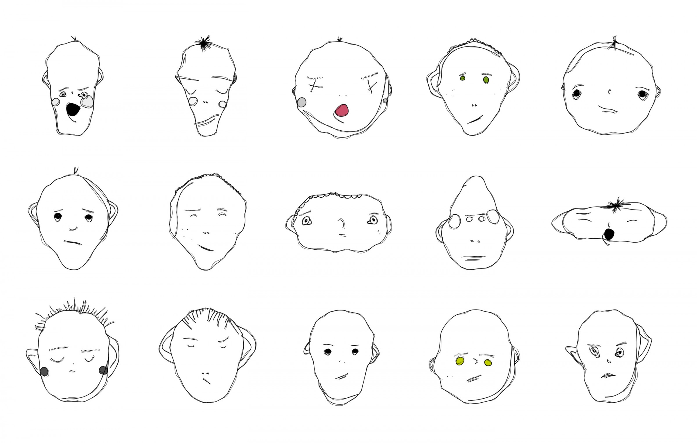
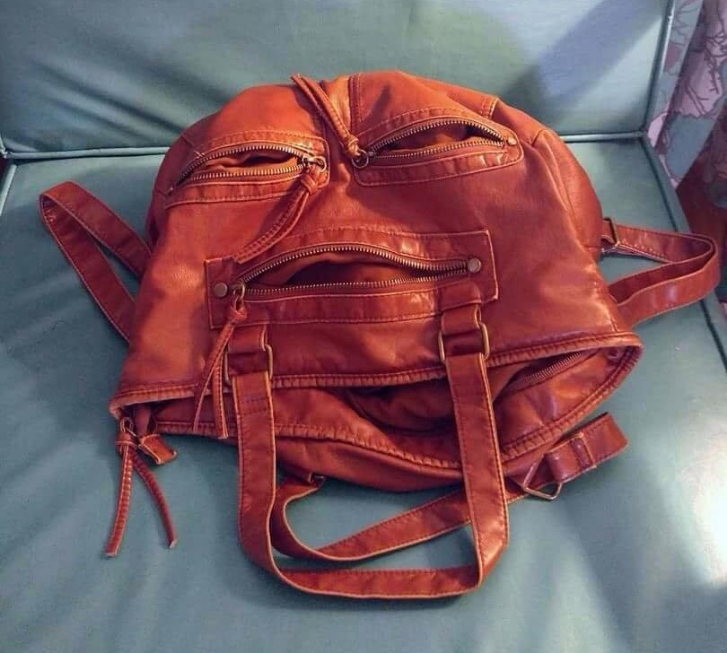
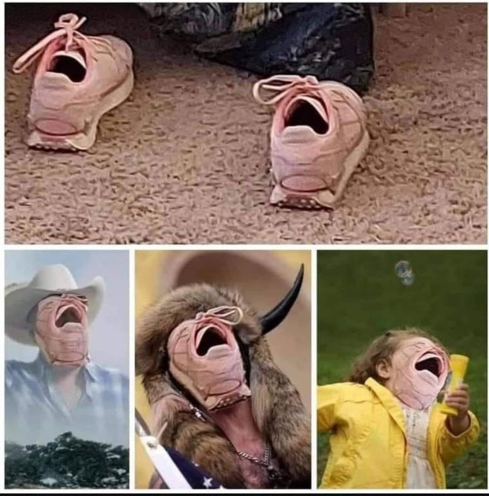
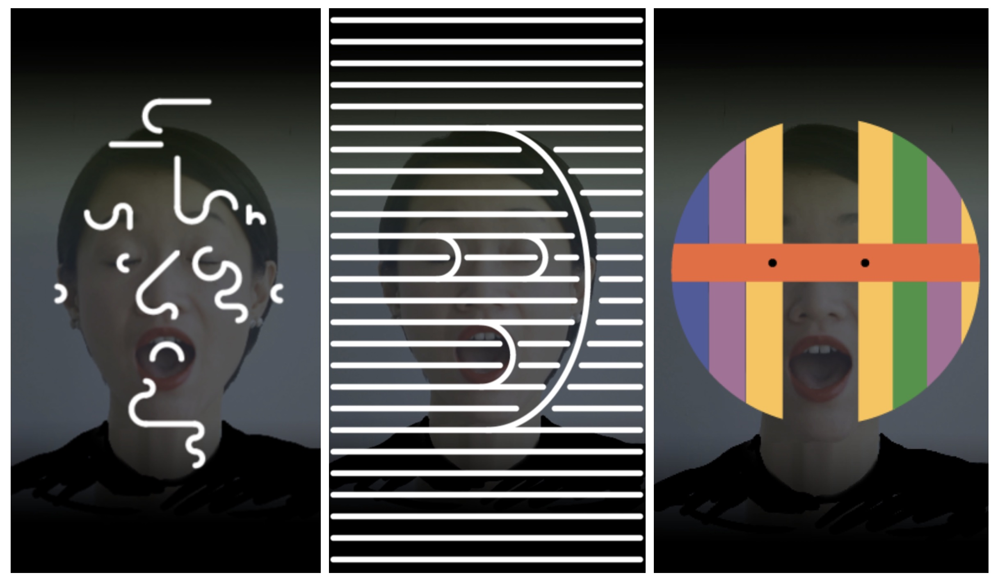

# Day 04

## Schedule

|Time               |Desc                                      |
|---                |---                                       |
|9:30 - 9:45        | Intro of the day                         |
|9:45 - 10:00       | Sharing                                  |
|10:00 - 12:00      | Work on assignement                      |
|12:00 - 13:00      | Lunch break :green_apple:                      |
|13:00 - 15:00      | Work on assignement                      |

## :neutral_face: Face Generator

### Brief

Create a program that is generating a parametric face. Your face should at least be controlled by 3 parameters but preferably more. Variations in some of the features can be used to control the expressiveness of the face or some other characteristics (species, gender, etc…) Differentiate continuous parameters (size and position of features) and discrete parameters (piercing, number of eyeballs). Consider the space you’re generating your face in (2D / 3D) and the view angle, front, profile, 3/4?  [^note-id1]

__You must first sketch your idea on paper before working with the software.__ 

### Variations / Steps [^note-id1]

- [ ] Bring your face to life
- [ ] Try using real world data as input
- [ ] Generate a collection (prints, cards) from your face collection

## Deliverables

* Code and documentation of your process, add some live example + gifs / images.
* Include a scan or photo of your drawings in the post

## More on Face Generator

### References

  
[_Weird Faces - Matthias Dörfelt_](https://www.creativeapplications.net/featured/weird-faces-study-by-matthias-dorfelt-using-paperjs/)

Computer generated images have a certain aesthetics to them that make them immediately recognizable as such by the trained eye. Weird Faces is an attempt to combine my old interest in illustration with programing, to create something procedural that has a truly individual artistic touch to it and is not instantly recognizable as a generative art piece. Even though, the faces look hand-drawn, they are entirely expressed by algorithmic rules. Each face is random, each face is unique. Still, they look similar to my actual hand drawn faces.

  
[_Strange Visions - Heather Dewey-Hagborg_](https://deweyhagborg.com/projects/stranger-visions)

In Stranger Visions Heather collected hairs, chewed up gum, and cigarette butts from the streets, public bathrooms and waiting rooms of New York City. She extracted DNA from them and analyzed it to computationally generate 3d printed life size full color portraits representing what those individuals might look like, based on genomic research. 

  
[_Lenny Face Generator_](https://lenny-face-generator.textsmilies.com/)

  
[_Pareidolia_](https://www.reddit.com/r/Pareidolia/)

Pareidolia is the tendency for perception to impose a meaningful interpretation on a nebulous stimulus, usually visual, so that one sees an object, pattern, or meaning where there is none.

  
[_> source_](https://www.instagram.com/p/CUqCDq8Jpff/)

  
[_Mas que la cara - Zach Lieberman_](https://zachlieberman.medium.com/m%C3%A1s-que-la-cara-overview-48331a0202c0)

Mas que la Cara is a public art installation in Downtown Houston which augments participants faces with dynamically generated masks that respond to their movements.

  
[_Face Trade - Matthias Dörfelt_](https://www.creativeapplications.net/c/face-trade-art-vending-machine-that-trades-mugshots-for-free-portraits/)  

Face Trade is an Art Vending Machine created by Matthias Dörfelt that dispenses unique prints of computer generated face drawings. Instead of paying with money, buyers trade a mugshot that is taken on the spot in order to be permanently stored in the Ethereum Blockchain, consequently turning the transaction into a semi-permanent Face Swap.

  
[_Type Face -Mary Huang_](http://www.creativeapplications.net/processing/typeface-processing/)  

Created by Mary Huang, TYPEFACE is a study of facial recognition and type design, creating a typeface that corresponds to each individual, like a typographic portrait. Somewhat similar to LAIKA project – interactive typeface, the challenge here were the limitations of geometric type system, being able to allow for a great amount of variation while maintaining a general level of quality in the letters.

  
<iframe src="https://player.vimeo.com/video/69694262?h=edd986e6e2" width="640" height="360" frameborder="0" allow="autoplay; fullscreen; picture-in-picture" allowfullscreen></iframe>

<a href="https://vimeo.com/69694262">Drawing faces instructed by facial recognition</a> from <a href="https://vimeo.com/user8828003">M Plummer-Fernandez</a> on <a href="https://vimeo.com">Vimeo</a>.
  
  

  
[_Deep Privacy - Hukkelas, Hakon and Mester, Rudolf and Lindseth, Frank_](https://github.com/hukkelas/DeepPrivacy)

  
<iframe src="https://player.vimeo.com/video/29348533?h=5c0cc36b58&title=0&byline=0&portrait=0" width="640" height="360" frameborder="0" allow="autoplay; fullscreen; picture-in-picture" allowfullscreen></iframe>

<a href="https://vimeo.com/29348533">Face Substitution</a> from <a href="https://vimeo.com/kylemcdonald">Kyle McDonald</a> on <a href="https://vimeo.com">Vimeo</a>.
  
  

See also other [similar](https://www.creativeapplications.net/sound/faceshift-studio-experiments-by-kyle-mcdonald/) / [experiments](https://www.creativeapplications.net/openframeworks/scramble-suit-face-tracking-openframeworks/) by Kyle

## References

### Example

  
[Mediapipe Facemesh in P5.js_](https://editor.p5js.org/guma/sketches/IAlxLpyRd)

### :books: Resources

* 

[^note-id1]: [Code as Creative Medium - Tega Brain / Golan Levin](https://mitpress.mit.edu/books/code-creative-medium)